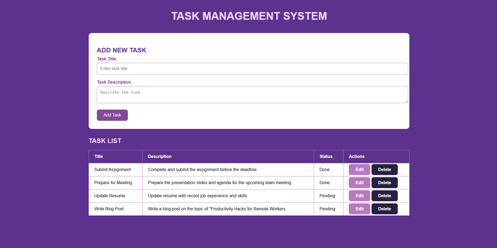
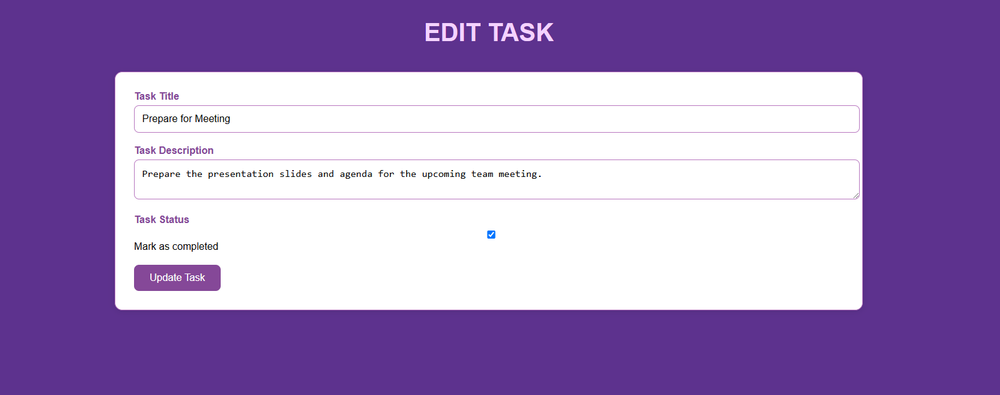

# Task Management System

A simple and efficient web application to manage tasks, built with **Flask** and **SQLite**. This system allows users to add, update, delete, and track tasks. The application uses a clean, modern UI with vibrant purple tones to provide a professional user experience.

<p align="center">
  
</p>

<p align="center">
  
</p>

## Features
- **Add a new task**: Create a task by entering a title and description.
- **View tasks**: Display a list of all tasks with their status (Pending/Done).
- **Edit a task**: Update the title, description, and mark a task as completed.
- **Delete a task**: Remove any task from the list.
- **Responsive design**: The system is mobile-friendly and adapts to smaller screen sizes.

## Tech Stack
- **Backend**: Flask (Python)
- **Database**: SQLite
- **Frontend**: HTML, CSS (with a modern design style)
- **CSS Framework**: Custom CSS with responsive design and vibrant purple theme

## Installation Instructions

### Prerequisites:
- Python 3.x
- Flask
- SQLite (built-in with Python)

### Steps:

1. **Clone the Repository**:
    ```bash
    git clone https://github.com/imranfaiz786/Task-Manager-py.git
    cd Task-Manager-py
    ```

2. **Install Required Libraries**:
    ```bash
    pip install flask
    ```

3. **Run the Application**:
    ```bash
    python app.py
    ```

## How it Works

- Home page (/): Displays a list of all tasks with options to add, edit, or delete tasks.
- Add new task (/add): A form to enter task details (title and description). Submitted data is added to the SQLite database.
- Update task (/update/<id>): Edit an existing task by updating its title, description, or completion status.
- Delete task (/delete/<id>): Remove a task from the task list.

## Contributing

Feel free to fork the repository and create pull requests. Contributions are welcome!

## License

This project is licensed under the **MIT License**.